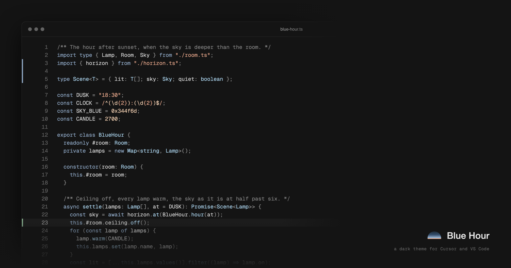

Font: Geist Mono. The file is `samples/blue-hour.ts`, colored by the theme.

# Blue Hour

A minimal dark theme for Cursor and VS Code, modeled on a room at blue hour: a near-black floor, blue accents and warm highlights. Most of the code is gray, with two blues for keywords and calls and a peach and a gold for strings and numbers.

## Install

- Cursor: [Open VSX](https://open-vsx.org/extension/caputoluca/bluehour) · VS Code: [Marketplace](https://marketplace.visualstudio.com/items?itemName=caputoluca.bluehour) · or grab the `.vsix` from [Releases](https://github.com/caputoluca/bluehour/releases) and use `Extensions: Install from VSIX…`
- Then `Cmd+K Cmd+T` and pick Blue Hour. You can also try it in the browser on [vscode.dev](https://vscode.dev/editor/theme/caputoluca.bluehour).

## How it works

The whole theme is minimal: one background, two color families, and gray for everything else.

- **One background.** The editor, sidebar, tabs, panels and status bar are all the same near-black, with thin lines between them instead of lighter panels. I wanted one calm, cohesive base under everything. The near-black is the floor of the room.
- **Two color families.** Blue hour is blue accents and warm highlights, so there is one cool family and one warm one. Keywords and tags are a soft blue, calls and types a lighter sky. Strings are peach, numbers and constants a lighter gold. I tried six full colors and it read easily but looked like every other theme. I tried making these four stronger and it turned into a blue theme, so they stay soft.
- **Everything else is gray.** This is the minimalism again: with so little color, contrast against the near-black does the rest. Names are the brightest gray in code. Punctuation is darker so the names stand out, comments are darker again, and line numbers are darker still. Calls keep a color because I find my place in a line by color, and an all-gray line gave me nothing to look for.

No italics and no bold in code. In Markdown, headings are bold and your own emphasis renders as written. Red only shows up for errors, invalid code, deletions and merge conflicts, and green only for additions and new files.

## The ladder

The ladder is the table below: every color sits on a lightness step, from the background up to the brightest text. The blue and the peach come from photos of the room, the sofa and the lamp. Colors sampled straight from the photos looked washed out on a screen, so I kept the hues and set each value by hand in OKLCH. Each one is checked against the background with [`tools/colortool.py`](tools/colortool.py) for WCAG ratio and APCA contrast (the Lc column). Names are Lc 80 and frame text is 70. Punctuation (43), comments (34) and line numbers (21) are lower on purpose, so you read them after the names.

| key | used for | hex | OKLCH L | chroma | hue | APCA Lc |
| --- | --- | --- | --- | --- | --- | --- |
| `ground` | editor, sidebar, tabs, panels, status bar, terminal; text on badges and buttons; ANSI black | `#141414` | 0.19 | 0 | — | — |
| `raised` | line highlight, inputs, hover, inactive list selection | `#1D1D1D` | 0.23 | 0 | — | — |
| `hairline` | borders, guides, whitespace, secondary buttons | `#2B2B2B` | 0.29 | 0 | — | — |
| `muted` | line numbers, inactive frame text, placeholders, hints, scrollbars, the active tab's line; ANSI bright black | `#636363` | 0.50 | 0 | — | 21 |
| `comment` | comments, docstrings, block quotes | `#808080` | 0.60 | 0 | — | 34 |
| `subtle` | punctuation, operators, the active line number, inactive tabs, breadcrumbs, icons, bracket pairs 1 and 4 | `#929292` | 0.66 | 0 | — | 43 |
| `frame` | frame text you read: explorer, status bar, headers, the active tab's label; default editor and terminal text; ANSI white | `#C4C4C4` | 0.82 | 0 | — | 70 |
| `text` | names: variables, properties, parameters | `#D4D4D4` | 0.87 | 0 | — | 80 |
| `bright` | carets, Markdown headings; ANSI bright white | `#E8E8E8` | 0.93 | 0 | — | 92 |
| `blue` | keywords, tags, focus, badges, links, primary buttons, info, the gutter's modified bar, bracket pairs 2 and 5; ANSI blue | `#8EA7C4` | 0.72 | 0.051 | 252 | 53 |
| `sky` | calls, types, decorators, link hover; ANSI cyan | `#A9D1EA` | 0.84 | 0.055 | 236 | 75 |
| `peach` | strings, matched text in lists, progress bar | `#E6A68A` | 0.78 | 0.085 | 45 | 61 |
| `gold` | numbers, constants, escapes, warnings, git modified, bracket pairs 3 and 6; ANSI yellow | `#ECCAAD` | 0.86 | 0.055 | 62 | 77 |
| `red` | errors, deletions, conflicts, invalid; ANSI red | `#DA827B` | 0.70 | 0.110 | 25 | 47 |
| `green` | additions, untracked, diff inserted; ANSI green | `#92BE9A` | 0.76 | 0.069 | 150 | 61 |
| `magenta` | ANSI magenta only | `#BAA8D0` | 0.76 | 0.060 | 305 | 58 |
| `highlight_low` | inactive selection, the explorer's open file, word and bracket match, other find matches, list and menu focus, the status bar while debugging | `#1E2A37` | 0.28 | 0.029 | 251 | — |
| `highlight_mid` | selection, strong word match, terminal selection | `#26394F` | 0.34 | 0.046 | 253 | — |
| `highlight_high` | the current find match | `#344F6D` | 0.42 | 0.060 | 252 | — |
| `red_bright` | ANSI bright red (the Claude Code spark) | `#F19E97` | 0.78 | 0.100 | 25 | 61 |
| `green_bright` | ANSI bright green | `#ABD8B3` | 0.84 | 0.070 | 150 | 76 |
| `gold_bright` | ANSI bright yellow | `#FFDEC1` | 0.92 | 0.053 | 63 | 90 |
| `blue_bright` | ANSI bright blue | `#ADC7E4` | 0.82 | 0.050 | 251 | 70 |
| `magenta_bright` | ANSI bright magenta | `#D2C3E5` | 0.84 | 0.049 | 305 | 73 |
| `sky_bright` | ANSI bright cyan | `#BFE4FB` | 0.90 | 0.050 | 235 | 86 |

Frame text you actually read (explorer, status bar, headers) is one step below the code. Inactive tabs and breadcrumbs are one step below that, and line numbers and placeholders are lower still. The terminal has more colors than the editor because ANSI needs eight: magenta exists only for it, and each colored bright is its base one step up. `palette.json` holds these values under these names, the theme's token rules use the same names, and `python3 tools/check.py` fails if any of the three drift.

## Working on it

- **See it:** open this folder in Cursor and press F5, or run `cursor --extensionDevelopmentPath="$PWD" "$PWD/samples"`. The `samples/` folder pins the theme to that window only. Its files cover TypeScript, TSX, Python, YAML, Markdown, JSON, shell, CSS, Prisma and SQL.
- **Check a color:** `python3 tools/colortool.py '#141414' '#E6A68A'` prints OKLCH, WCAG and APCA against the background. **Check the names:** `python3 tools/check.py`.
- **Build:** `npx @vscode/vsce package`, then `cursor --install-extension bluehour-<version>.vsix`.
- Rules, commands and how the hero is made: [`AGENTS.md`](AGENTS.md).

## Design notes

How it got here, what I tried and threw away, and the sources: [`design-notes.md`](design-notes.md). What shipped when: [`CHANGELOG.md`](CHANGELOG.md).

## License

MIT · © 2026 Luca Caputo
